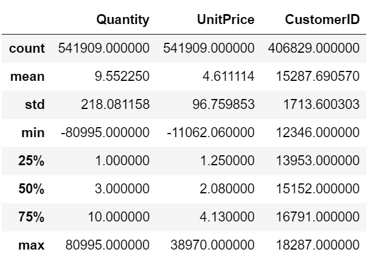

<h1><b>Customer-Segmentation</b></h1>
<h5>Customer Segmentation using Python, Numpy, Pandas, Sckit learn, Scipy,matplotlib and seaborn</h5>

Dataset ***OnlineRetail.csv*** contains all the transactions occuring between 01-Dec-2010 and 09-Dec-2011 for a UK-based and registered non-store online retail.

### Steps involve in the Customer Segmentation are categorized into following:

1. Reading and Understanding Dataset.
1. Cleaning the Data.
1. Data Preparation.
1. Building the Model.
1. Final Analysis.

### Dataset Description

