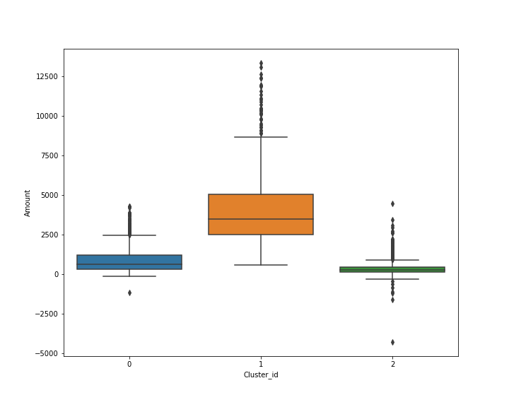
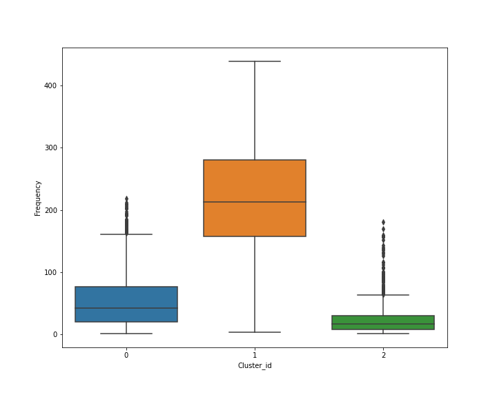
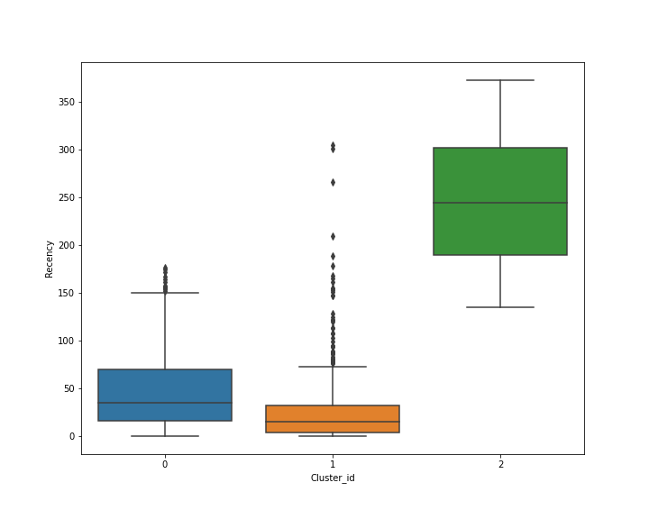

<h1><b>Customer-Segmentation</b></h1>
<h5>Customer Segmentation using Python, Numpy, Pandas, Sckit learn, Scipy,matplotlib and seaborn</h5>

Dataset ***OnlineRetail.csv*** contains all the transactions occuring between 01-Dec-2010 and 09-Dec-2011 for a UK-based and registered non-store online retail.

### Steps involve in the Customer Segmentation are categorized into following:

1. Reading and Understanding Dataset.
1. Cleaning the Data.
1. Data Preparation.
1. Building the Model.
1. Final Analysis.

### Dataset Description

### Outlier Analysis Insights is shown below:

### In the customer segmentation, I have used the K-Means CLustering Algorithm
K-Means is one of the simplest and useful Unsupervised Machine Learning Algorithm. To find the optimal number of clusters for K-Means Clustering, I have used ***Elbow Method*** whose plot is shown below:

## After performing all the necessary processing and implementing model, we have got different insights that shows relation between cluster and attributes:

***1. Cluster ID VS Amount***

***1. Cluster ID VS Frequency***

***1. Cluster ID VS Recency***

